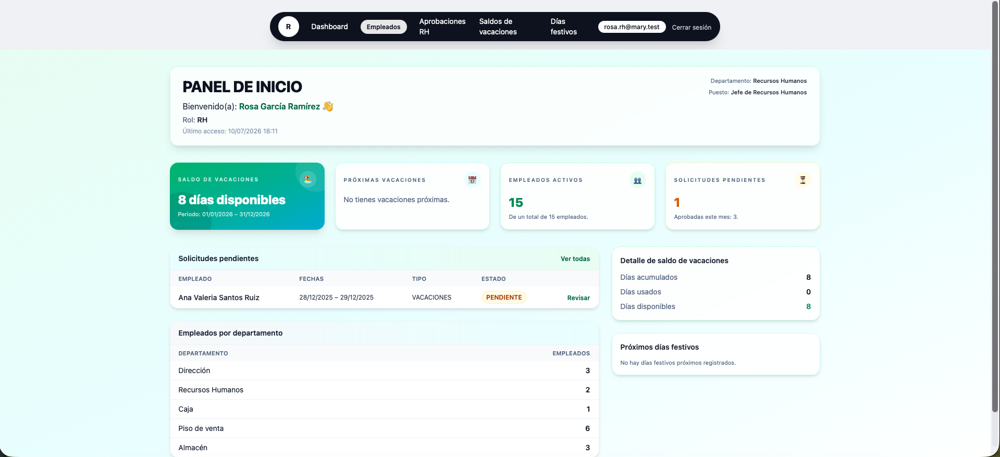
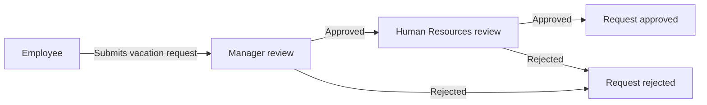
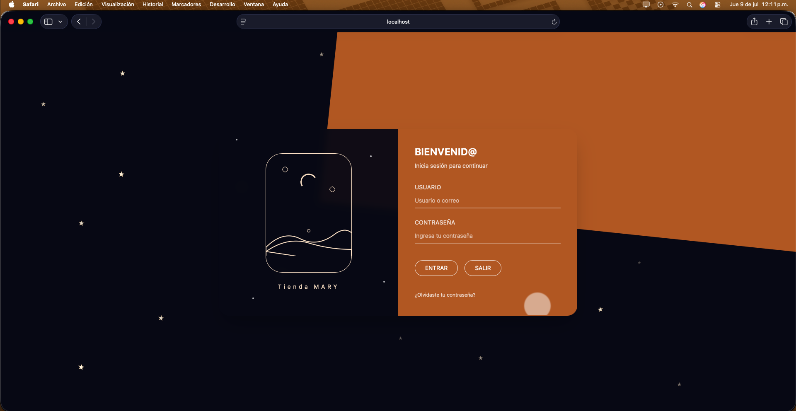
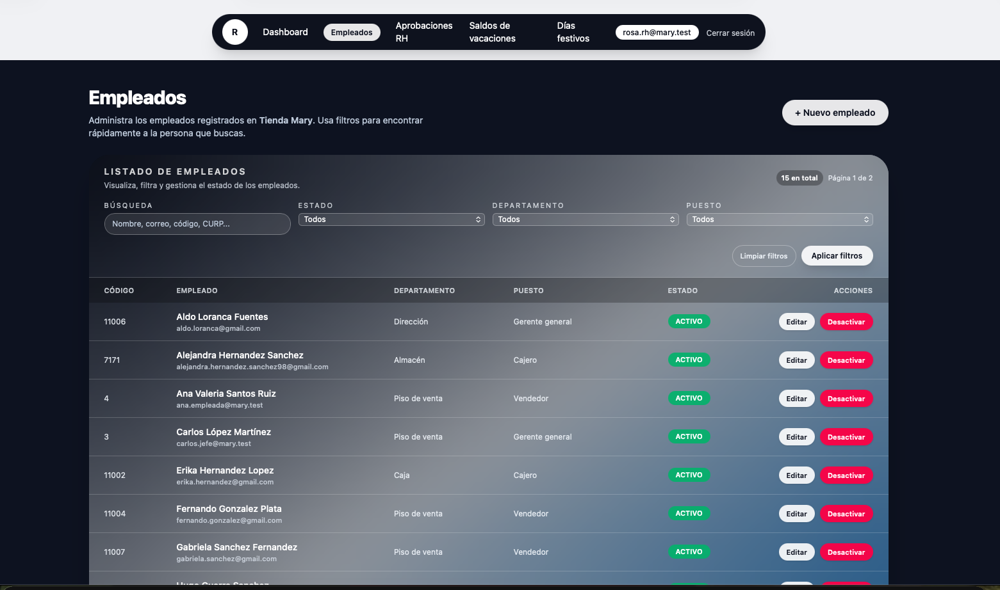
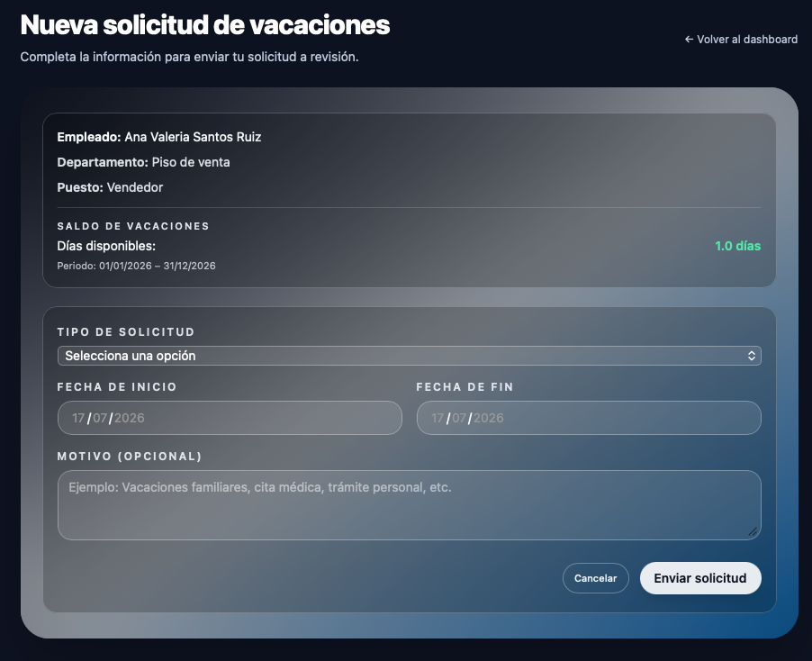
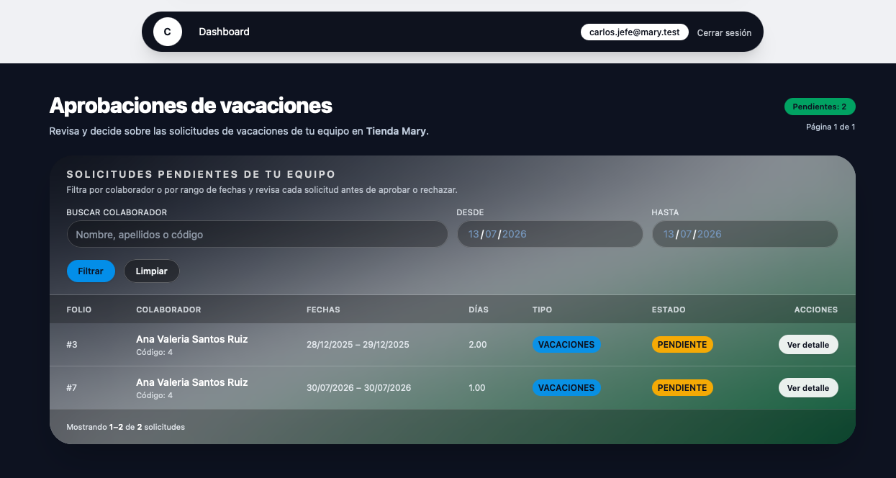
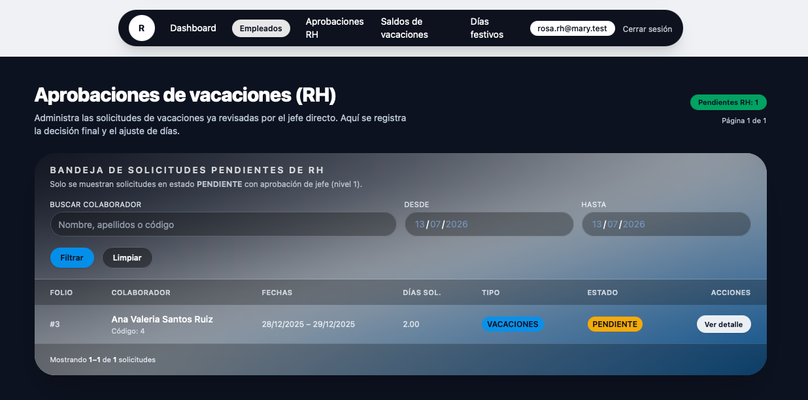

# Mary Store Employee & Vacation Management System

A web application for centralizing employee records and managing vacation requests through a two-level approval workflow.


<!--
Add a sanitized application screenshot to:
docs/images/dashboard.png

Then remove the comment markers from the following line:

-->

## Overview

This project was developed to support the administrative processes of Mary Store, a retail business located in Puebla, Mexico.

The previous workflow relied on paper job application forms and manually managed employee information. This application digitizes that process by allowing authorized users to register, organize and maintain employee records from a computer.

Each employee can be associated with a department, job position, system account and vacation balance. Employees can submit vacation requests, which are reviewed through two approval levels:

1. The employee's manager reviews the request.
2. Human Resources performs the final review.

The application centralizes employee information and provides a traceable workflow for managing vacation requests and decisions.

## Main features

- Secure authentication using a username or system email.
- Role-based access control.
- Four system roles:
  - Administrator
  - Human Resources
  - Manager
  - Employee
- Employee registration and record management.
- Department and job-position management.
- User account administration.
- Individual vacation balance management.
- Vacation request submission.
- First-level approval by the employee's manager.
- Final approval by Human Resources.
- Vacation request status tracking.
- Holiday calendar management.
- Administrative dashboard.
- Self-service password updates.
- Login throttling to reduce repeated authentication attempts.

## Vacation approval workflow



## User roles

| Role | Main responsibilities |
|---|---|
| Administrator | Manages users, employees, departments, job positions and system configuration. |
| Human Resources | Reviews vacation requests at the final approval level and manages employee information. |
| Manager | Reviews vacation requests submitted by employees under their supervision. |
| Employee | Reviews personal information, checks the available vacation balance and submits vacation requests. |

## Tech stack

### Backend

- PHP 8.2
- Laravel 12
- Laravel Blade
- Eloquent ORM
- Session-based authentication
- PHPUnit 11

### Frontend

- Blade templates
- Tailwind CSS 4
- JavaScript
- Axios
- Vite 7

### Database

- MySQL 8.0+
- Laravel migrations
- Eloquent ORM
- Database seeders with demonstration data

## Requirements

Before installing the project, make sure you have:

- Git
- PHP 8.2 or later
- Composer 2
- Node.js 20.19+ or 22.12+
- npm
- MySQL 8.0 or later
- PHP PDO MySQL extension

## Installation

### 1. Clone the repository

```bash
git clone https://github.com/hunsett/mary-employee-vacation-manager.git
cd tiendita
```

### 2. Install PHP dependencies

```bash
composer install
```

### 3. Install frontend dependencies

```bash
npm install
```

### 4. Create the environment file

The following command works without overwriting an existing `.env` file:

```bash
php -r "file_exists('.env') || copy('.env.example', '.env');"
```

### 5. Generate the application key

```bash
php artisan key:generate
```
### 6. Create the MySQL database

Access MySQL and create a database for the application:

```sql
CREATE DATABASE tiendita
    CHARACTER SET utf8mb4
    COLLATE utf8mb4_unicode_ci;

The default `.env.example` file is already configured to use SQLite:

```env
DB_CONNECTION=mysql
DB_HOST=127.0.0.1
DB_PORT=3306
DB_DATABASE=mary_employees
DB_USERNAME=root
DB_PASSWORD=
```

### 7. Run migrations and seeders

```bash
php artisan migrate --seed
```

This command creates the database structure and loads demonstration records for departments, job positions, employees, users, vacation balances and holidays.

### 8. Start the development environment

```bash
composer run dev
```

This command starts the Laravel development server, Vite, the queue listener and the application log viewer.

Open the application at:

```text
http://127.0.0.1:8000
```

## Demonstration accounts

The database seeders include the following demonstration accounts.

| Role | Username | System email | Password |
|---|---|---|---|
| Administrator | `admin` | `admin@mary.test` | `admin123` |
| Human Resources | `rosa.rh` | `rosa.rh@mary.test` | `rh123456` |
| Manager | `carlos.jefe` | `carlos.jefe@mary.test` | `jefe1234` |
| Employee | `ana.empleada` | `ana.empleada@mary.test` | `empleado123` |

The login form accepts either the username or the system email.

> These accounts are intended exclusively for local demonstration and testing. Never reuse these passwords in a production environment.

## Running tests

Run the current test suite with:

```bash
composer test
```

Before deploying the application, additional feature tests should be added for authentication, role permissions, vacation requests and the two-level approval workflow.

## Suggested project structure

```text
app/
├── Http/
│   ├── Controllers/
│   ├── Middleware/
│   └── Requests/
├── Models/
database/
├── migrations/
└── seeders/
resources/
└── views/
routes/
└── web.php
tests/
├── Feature/
└── Unit/
```

## Screenshots

### Login



### Administrative dashboard


### Employee management



### Vacation request



### Two-level approval workflow





## Security and privacy

- The public repository must contain demonstration data only.
- Real employee information must never be committed.
- Environment files and credentials must remain excluded from version control.
- Production secrets must be stored in environment variables.
- Screenshots must use fictional or sanitized employee information.
- The demonstration passwords must be changed before using the project in another environment.
- A complete security review is required before processing real employee information.

## Project context

This repository presents an academic and portfolio version of the employee and vacation management system developed for Mary Store.

The public version is intended to demonstrate the application's architecture, role-based access control, database design and vacation approval workflow. It should not be used with real employee information without additional security, privacy and production-readiness reviews.

## Maintainer

**Juan de Jesús Álvarez**

- GitHub: [@hunsett](https://github.com/hunsett)
- LinkedIn: [Juan de Jesús Álvarez](https://www.linkedin.com/in/juan-alvarez-dev99)
- Email: [alvarezjesus9901@gmail.com](mailto:alvarezjesus9901@gmail.com)
